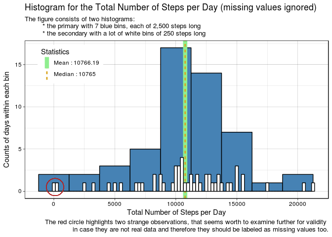
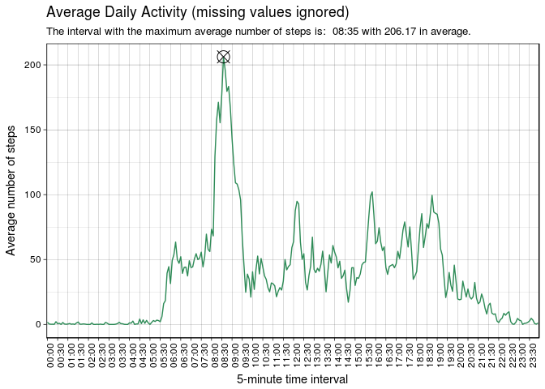
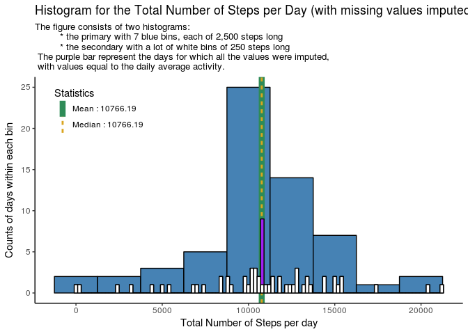
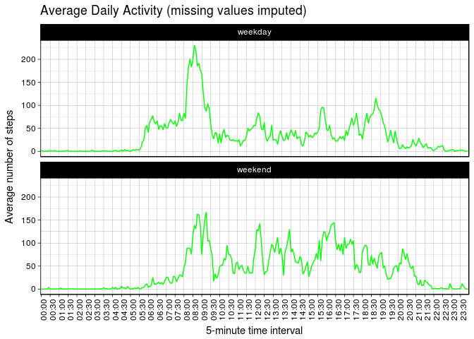

***
***
 

 
### Table of contents


  0. Loading all required libraries
  1. **Loading and preprocessing the data**  
  
    * Assessment's guidelines
    * Assessment's information on data
    * Loading the data in R
    * Preprocessing the data
    
  2. **What is mean total number of steps taken per day?**
  
    * Assessment's guidelines
    * Creating a table with the total number of steps per day 
    * Calculating the mean and median of total number of steps per day 
    * Constructing a figure to display the total number of steps per day 
        * Examining further two strange days
  3. **What is the average daily activity pattern?**
    * Assessment's guidelines
    * Creating a table with the average number of steps per interval 
    * Finding the interval with the maximum value of average number of steps
    * Constructing a figure to display the average daily activity
  4. **Imputing missing values**
    * Assessment's guidelines
    * Exploring the missing data
    * Imputing the missing data
    * Examining the effects of the imputation in the data
        * Calculating the total number of steps per day, with imputed data
        * Constructing a figure to display the total number of steps per day,
        with missing values imputed
        * Examining the effect of imputation on variability for total steps per day
        * Summarizing the results of the imputation on the data
  5. **Are there differences in activity patterns between weekdays and weekends?**
    * Assessment's guidelines
    * Creating a table with the __wday__ variable
    * Creating a panel plot to display the average daily activity pattern
    over the __wday__ variable
    * Highlighting some insights provided from the panel plot
  6. Informations for reproduction of the report


***


### Loading all required libraries


There are two libraries, that are required for this analysis:


```r
library(dplyr)
```

```
## 
## Attaching package: 'dplyr'
```

```
## The following objects are masked from 'package:stats':
## 
##     filter, lag
```

```
## The following objects are masked from 'package:base':
## 
##     intersect, setdiff, setequal, union
```

```r
library(ggplot2)
```


***


## Loading and preprocessing the data


#### Assessment's guidelines:

> 1. Load the data (i.e. read.csv())
> 2. Process/transform the data (if necessary) into a format suitable for your analysis
 
The data is loaded from the file "activity.csv", which is available to
[download](https://github.com/jzstats/RepData_PeerAssessment1/blob/master/activity.zip?raw=true). 


#### Assessment's information on data:

The variables included in this dataset are:

* **steps**: Number of steps taking in a 5-minute interval (missing
    values are coded as `NA`)

* **date**: The date on which the measurement was taken in YYYY-MM-DD
    format

* **interval**: Identifier for the 5-minute interval in which
    measurement was taken
  
The dataset is stored in a comma-separated-value (CSV) file
and there are a total of 17,568 observations in this dataset.

(* _the informations above about the data are quoted from the assessment's instructions_)
  

#### Loading the data in R

The classes of the variables, **date** and  **interval**, should be specified manually
as character, because of the 'special' forms in which their values are represented.
They will get reformatted in the next step.


```r
activity_monitoring_data <- read.csv(file = "activity.csv",
                                     colClasses = c("integer",    # steps
                                                    "character",  # date
                                                    "character")  # interval
                                     )
```


#### Preprocessing the data

The data gets preprocessed before the analysis,
to reformat the values in which dates and time-intervals are represented.

Specifically, there will be two main changes:
 
  1. the double quotes ('"%Y-%m-%d"'), that enclose the **date**'s value
  will get removed and the class will be coerced to Date.
  2. the **interval**'s values are more troublesome, to get them transformed
  into the common time format: HH:MM.
    * The time intervals are supplied in a form similar to "Hours:Minutes" 
    but without ":" and all the leading "0"'s ignored/missing. 
    Some examples that will cause problems are the following:  
        + 00:05 that is represented as: 5  
        + 00:55 that is represented as: 55  
        + 05:55 that is represented as: 555  
       
        To overcome this, for each value based on the number of characters
        it consists of, a sting with "0"'s is added at the begging,
        to make it 4-character long. Then the ":" is placed in the middle to
        make the values appear in this form:  HH:MM


```r
preprocessed_data <- activity_monitoring_data %>%
      mutate("date" = as.Date(gsub('"', '', date)),
             # The interval values are supplied in a vapply(),
             # where an anonymous function checks the number of character
             # in each observation, adds an appropriate number of "0"'s to make
             # it 4-character long and finally inserts ":" in the middle
             # to separate Hours from Minutes.
             "interval" = vapply(interval, function(raw_time_interval) {
                   string_to_add <- paste(rep("0", times = 4 - nchar(raw_time_interval)),
                                          collapse = "")
                   new_interval_string <- paste0(string_to_add, raw_time_interval)
                   final_interval_format <- paste(substring(new_interval_string, 1, 2),  # Hours
                                                  substring(new_interval_string, 3, 4),  # Minutes
                                                  sep = ":")
             },
             character(1)))
```


***


## What is mean total number of steps taken per day?


#### Assessment's guidelines:

> For this part of the assignment, you can ignore the missing values in the dataset.
> 
> 1. Calculate the total number of steps taken per day
> 2. If you do not understand the difference between a histogram and a barplot,
   research the difference between them.
   Make a histogram of the total number of steps taken each day
> 3. Calculate and report the mean and median of the total number of steps taken per day
 
 
#### Creating a table with the total number of steps per day

The new table will be constructed from the preprocessed data, by filtering out
all missing observation for the **steps** variable (as the guidelines suggest).

 

```r
total_steps_per_day <- preprocessed_data %>%
      filter(!is.na(steps)) %>%
      group_by(date) %>%
      summarise("total_steps" = sum(steps)) %>%
      ungroup()
```


#### Calculating the mean and median of total number of steps per day

The mean and the median will be calculated and get stored in a table
that will be used to add these statistics in the *histogram of the total
steps per day* which will be constructed in the next step. 

The table contains two variables:

  * **Statistics** : the name of a statistic ("Mean" or "Median"),
  combined with its value (as character), which is helpful to display
  the statistics nicely in the legend of the figure
  * **value** : the value of the statistic that will be used to add lines,
  indicating the position of the statistics relative to the values for total steps
 

```r
# Calculates the statistics and rounds them at 2 digits
mean_of_total_steps_per_day <- round(mean(total_steps_per_day$total_steps), 2)
median_of_total_steps_per_day <- round(median(total_steps_per_day$total_steps), 2)

# Creates a data frame with both statistics and their values
statistics_for_total_steps_per_day <- data.frame(
      "Statistics" = paste(c("Mean ", "Median "),
                           c(mean_of_total_steps_per_day, median_of_total_steps_per_day),
                           sep = ": "),
      "value" = c(mean_of_total_steps_per_day, median_of_total_steps_per_day)
)

# The results are shown below
statistics_for_total_steps_per_day["Statistics"]
```

```
##        Statistics
## 1 Mean : 10766.19
## 2  Median : 10765
```
 
**It is worth noticing that the two statistics are very close.**
 
 
#### Creating a figure to display the total number of steps per day 
 
A figure is constructed to give a general idea of the distribution
of total steps per day, which contains:

  1. two histograms: 
      * a primary with bins of length: 2500 steps 
      * a secondary with bins of length: 250 steps 
  2. the mean and the median as lines and their values included in the legend 
  3. two strange days, highlighted with a red circle, because they suggest
  a suspiciously low, total number of steps, for those days. 
 

```r
ggplot(total_steps_per_day, aes(total_steps)) +
      geom_histogram(fill = "steelblue", color = "black", binwidth = 2500) +
      labs(title = paste("Histogram for the Total Number of Steps per Day",
                         "(missing values ignored)"),
           subtitle = paste0("The figure consists of two histograms: \n",
                            "\t * the primary with 7 blue bins, each of 2,500 steps long \n",
                            "\t * the secondary with a lot of white bins of 250 steps long"),
           caption = paste0("The red circle highlights two strange observations, ",
                           "that seems worth to examine further for validity \n",
                           "in case they are not real data and therefore ",
                           "they should be labeled as missing values too.")) +
      xlab("Total Number of Steps per Day") +
      ylab("Counts of days within each bin") +
      geom_vline(data = statistics_for_total_steps_per_day,
                 aes(xintercept = value, linetype = Statistics),
                 color = c("lightgreen", "goldenrod"), size = c(3, 1)) +
      geom_histogram(fill = "white", color = "black", binwidth = 250) +
      geom_point(aes(x = 100, y = 0.5), color = "firebrick", shape = 1, size = 12) +
      theme_linedraw() +
      theme(legend.position = c(0.15, 0.85))
```

<!-- -->


##### Examining further two strange days

The dates in which those strange results happened are the two days
with the lowest total number of steps, which will be identified and have their
observations examined further to see whether they represent real data
or they are results of mistakes in some stage of the raw data collection.


```r
# Identifies the dates with the strange results
strange_observations <- arrange(total_steps_per_day, total_steps)[1:2, ]

# The two days are shown below
strange_observations
```

```
## # A tibble: 2 x 2
##   date       total_steps
##   <date>           <int>
## 1 2012-11-15          41
## 2 2012-10-02         126
```

Those two dates, whose total number of steps seem to be suspiciously small,
cause even more questions when we find out that all the steps in them
happened just in two consecutive 5-minute time intervals for each day,
while there were observed, exactly zero steps, in every other interval. 

The following table provides the details:


```r
# Creates a table containing only the observation for the strange dates
# in which more than zero steps were observed
details_on_strange_observations <- preprocessed_data %>%
      filter(date %in% strange_observations$date, steps > 0)
    
# The results are shown below
details_on_strange_observations
```

```
##   steps       date interval
## 1   117 2012-10-02    22:10
## 2     9 2012-10-02    22:15
## 3    33 2012-11-15    03:25
## 4     8 2012-11-15    03:30
```

The validity of those observations for the dates: "2012-10-02" and "2012-11-15",
is highly questionable, because those results can happen only under very special
situations. If they are actually not valid, they are expected to decrease the mean's value,
which is sensitive to outliers but not a worth-mentioning effect will occur
to the median of total steps per day (as the median is more robust to outliers).

Although these observation are most likely not valid, they will be included
in the analysis which follows the guidelines suggested by the assessment. 
 
**As a conclusion, it is highlighted the fact that their validity is questionable.**


***


## What is the average daily activity pattern?


#### Assessment's guidelines:

> 1. Make a time series plot (i.e. type = "l") of the 5-minute interval (x-axis) and the average number of steps taken, averaged across all days (y-axis)
> 2. Which 5-minute interval, on average across all the days in the dataset, contains the maximum number of steps?


#### Creating a table with the average number of steps per interval


Another table will be constructed from the preprocessed data, by filtering out 
all missing observation for the **steps** variable (as the guidelines suggest),
for the average daily activity, as it is encapsulated by the average number of
steps per interval.


```r
average_steps_per_interval <- preprocessed_data %>%
      filter(!is.na(steps)) %>%
      group_by(interval) %>%
      summarise("average_steps" = mean(steps)) %>%
      ungroup()
```


#### Finding the interval with the maximum value of average number of steps

The 5-minute interval with the maximum average number of steps,
will be calculated from the table created in the previous step.


```r
# Find the interval with the maximum average number of steps
interval_with_max_average_steps <- average_steps_per_interval %>%
      filter(average_steps == max(average_steps)) %>%
      mutate(average_steps = round(average_steps, 2))

# The result is shown below
interval_with_max_average_steps
```

```
## # A tibble: 1 x 2
##   interval average_steps
##   <chr>            <dbl>
## 1 08:35             206.
```


#### Constructing a figure to display the average daily activity pattern

The figure below displays the daily average activity pattern
in which the interval with maximum average number of steps is marked.


```r
ggplot(average_steps_per_interval, aes(x = interval, y = average_steps)) +
      geom_line(aes(group = 1), color = "seagreen") +
      geom_point(data = interval_with_max_average_steps,
                 aes(x = interval, y = average_steps),
                 shape = 13, size = 5) +
      labs(title = "Average Daily Activity (missing values ignored)",
           subtitle = paste("The interval with the maximum average number of steps is: ",
                            interval_with_max_average_steps$interval,
                            "with", interval_with_max_average_steps$average_steps,
                            "in average.")) +
      xlab("5-minute time interval") +
      scale_x_discrete(breaks = average_steps_per_interval$interval[seq(1, 288, by = 6)]) +
      ylab("Average number of steps") +
      theme_linedraw() +
      theme(axis.text.x = element_text(angle = 90, vjust = 1))
```

<!-- -->


***

## Imputing missing values

Assessment's guidelines:

> Note that there are a number of days/intervals where there are missing values (coded as NA). The presence of missing days may introduce bias into some calculations or summaries of the data.
>
> 1. Calculate and report the total number of missing values in the dataset (i.e. the total number of rows with NA)
> 2. Devise a strategy for filling in all of the missing values in the dataset. The strategy does not need to be sophisticated. For example, you could use the mean/median for that day, or the mean for that 5-minute interval, etc.
> 3. Create a new dataset that is equal to the original dataset but with the missing data filled in.
> 4. Make a histogram of the total number of steps taken each day and Calculate and report the mean and median total number of steps taken per day. Do these values differ from the estimates from the first part of the assignment? What is the impact of imputing missing data on the estimates of the total daily number of steps?


#### Exploring the missing data

The indexes corresponding to missing values are identified and used to calculate
the total number of missing values as well as the percentage of them over
the total number of observations in the data.


```r
# Identifies the indexes of missing observations
missing_indexes <- which(is.na(preprocessed_data$steps))

# Calculates the total number of missing values in the data
total_number_of_missing_values <- length(missing_indexes)

# Calculates the percentage of missing_values in the data
percentage_of_missing_values <- total_number_of_missing_values / nrow(preprocessed_data)

# The results are shown below:
total_number_of_missing_values
```

```
## [1] 2304
```

```r
percentage_of_missing_values
```

```
## [1] 0.1311475
```

**There are 2304 missing observations which is about 13% of the data.**

Another interesting thing that can be examined in the missing data is
the length of the gaps with consecutive missing values.


```r
# Counts the length of the runs of observations with and without missing values
missing_data_runs <- rle(is.na(preprocessed_data$steps))

# Creates a data frame with the missing data runs and their lengths   
missing_data_gaps <- data.frame("missing" = missing_data_runs$values,
                                "length" = missing_data_runs$lengths) %>%
      # keeps only the observation referring to the runs with missing values
      filter(missing == TRUE) %>%
      transmute("gap_id" = 1:length(missing),
                "gap_length" = length)

# The result suggest that the missing values are not missing completely at random
missing_data_gaps
```

```
##   gap_id gap_length
## 1      1        288
## 2      2        288
## 3      3        288
## 4      4        288
## 5      5        576
## 6      6        288
## 7      7        288
```

There are 7 gaps, 6 of them are equal with lengths of 288 and one with double
that length 576 (= 2 * 288) consecutive missing observations.
It seems that there is something special about the number 288.
Clearly the missing data is NOT missing completely at random.

Given the fact that a day consists of 288, 5-minute intervals,
it seems possible that there are whole days only with missing observations
for all of their values. Indeed this is what is happening:


```r
# Isolates the missing data
missing_data <- preprocessed_data[missing_indexes, ]

# Counts the number of missing observations for each date
missing_data_per_date <- missing_data %>%
      group_by(date) %>%
      summarise("number_of_NAs" = sum(is.na(steps))) %>%
      # manually associates the dates with their respective gaps
      # to create a more informative result
      mutate("gap_id" = as.factor(c(1, 2, 3, 4, 5, 5, 6, 7))) %>%
      select(gap_id, date, number_of_NAs)

# The results show that indeed we have 8 whole days only with missing values
missing_data_per_date
```

```
## # A tibble: 8 x 3
##   gap_id date       number_of_NAs
##   <fct>  <date>             <int>
## 1 1      2012-10-01           288
## 2 2      2012-10-08           288
## 3 3      2012-11-01           288
## 4 4      2012-11-04           288
## 5 5      2012-11-09           288
## 6 5      2012-11-10           288
## 7 6      2012-11-14           288
## 8 7      2012-11-30           288
```


**There are 8 whole days out of the total 61, that have missing values
for all their 288 5-minute time intervals, two of them are consecutive,
resulting in the 7 gaps that compose the missing data.**


#### Imputation of missing data

In order to impute the missing values a naive method will be used,
that is considered sufficient for the needs of this analysis.
The average value of the steps per 5-minite interval
will be supposed to represent 'well enough' the daily activity pattern
and therefore will be acceptable to use it to fill the values of those 8 days.
As a result the same numbers will be used for each one of the 8 gaps,
which seems to produce realistic results without big impact to the central 
tendency of the sample's values.
However, it is expected to reduce the standard deviation/variance of the sample,
but as we are more interested in mean and median values of steps per day
and intervals, this effect can be safely ignored. 


```r
# Makes a copy of the preprocessed data with the missing values
processed_data <- preprocessed_data

# Extracts the average number of steps per interval from a table created before.
average_daily_pattern <- average_steps_per_interval$average_steps

# Uses the average daily activity to fill the missing observations,
# of the 8 days by repeating it 8 times and imputing the values
# where the indexes for the missing data suggest.
processed_data[missing_indexes, "steps"] <- rep(average_daily_pattern, times = 8)
```


#### Examining the effects of the imputation in the data

##### Calculating the total number of steps per day, with imputed data

The process followed in one of the previous steps, used to calculate
the total number of steps per day is repeated, but this time with
the processed data which has the missing values imputed. 
 
The result is table with for total number of steps per day,
from which it can be computed the mean and the median.


```r
# Creates a new data frame with the total number of steps per day
total_steps_per_day_imputed <- processed_data %>%
      group_by(date) %>%
      summarise("total_steps" = sum(steps)) %>%
      ungroup()

# Calculates the statistics and round them at 2 digits
mean_of_total_steps_per_day_imputed <- round(mean(total_steps_per_day_imputed$total_steps), 2)
median_of_total_steps_per_day_imputed <- round(median(total_steps_per_day_imputed$total_steps), 2)

# Creates a data frame with both statistics and their values
statistics_for_total_steps_per_day_imputed <- data.frame(
      "Statistics" = paste(c("Mean ", "Median "),
                           c(mean_of_total_steps_per_day_imputed, median_of_total_steps_per_day_imputed),
                           sep = ": "),
      "value" = c(mean_of_total_steps_per_day_imputed, median_of_total_steps_per_day_imputed)
)

# The results are shown below
statistics_for_total_steps_per_day_imputed["Statistics"]
```

```
##          Statistics
## 1   Mean : 10766.19
## 2 Median : 10766.19
```

##### Constructing a figure to display the total number of steps per day, with missing values imputed

A figure like the previous is constructed to display all those informations
in contrast with the results taken when the missing data was ignored.
The imputed values will be now filled with purple color in secondary histogram,
in order to expose some of the effects of the imputation on the data.


```r
# Creates a histogram to display the new results
ggplot(total_steps_per_day_imputed, aes(total_steps)) +
      geom_histogram(fill = "steelblue", color = "black", binwidth = 2500) +
      labs(title = "Histogram for the Total Number of Steps per Day (with missing values imputed)",
           subtitle = paste("The figure consists of two histograms: \n",
                            "\t * the primary with 7 blue bins, each of 2,500 steps long \n",
                            "\t * the secondary with a lot of white bins of 250 steps long \n",
                            "The purple bar represent the days for which all the values were imputed, \n",
                            "with values equal to the daily average activity.")) +
      xlab("Total Number of Steps per day") +
      ylab("Counts of days within each bin") +
      geom_vline(data = statistics_for_total_steps_per_day_imputed,
                 aes(xintercept = value, linetype = Statistics),
                 color = c("seagreen", "goldenrod"), size = c(3, 1)) +
      geom_histogram(fill = "purple", color = "black", binwidth = 200) +
      geom_histogram(data = total_steps_per_day, aes(total_steps),
                     fill = "white", color = "black", binwidth = 200) +
      theme_classic() +
      theme(legend.position = c(0.15, 0.85))
```

<!-- -->

##### Examining the effect of imputation on variability for total steps per day

It is reasonable to expect an significant decrease in the variation, as a
result of the repeated values we imputed that were the same as the
average value of each interval.


```r
# Variance when missing data was ignored
var(total_steps_per_day$total_steps)
```

```
## [1] 18225902
```

```r
# Variance when missing data was imputed
var(total_steps_per_day_imputed$total_steps)
```

```
## [1] 15795782
```
   
Indeed there is decrease in the variability of total steps per day
as indicated by the variance before and after the imputation of missing data.


##### Summarizing the effects of the imputation on the data

As a result of the imputations:
  1. The mean has stayed exactly the same
  2. The median has been slightly dragged towards the mean (almost the same)
  3. The mode has changed (not too much) as a result of imputing exactly
  the same values for 8 days, but it has remained between 10,000 and 12,500 steps
  4. The variance (and therefore the standard deviation too) has significantly
      decreased (although it is not of much importance for this analysis)
    

***

## Are there differences in activity patterns between weekdays and weekends?

Assessment's guidelines:

> For this part the weekdays() function may be of some help here. Use the dataset with the filled-in missing values for this part.
>
> 1. Create a new factor variable in the dataset with two levels – “weekday” and “weekend” indicating whether a given date is a weekday or weekend day.
> 2. Make a panel plot containing a time series plot (i.e. type = "l") of the 5-minute interval (x-axis) and the average number of steps taken, averaged across all weekday days or weekend days (y-axis). See the README file in the GitHub repository to see an example of what this plot should look like using simulated data.


#### Creating a table with the __wday__ variable

Creates another table with an additional variable **wday**,
which is a factor with two levels, *weekday* or *weekend*.


```r
average_steps_per_interval_imputed_plus_wday <- processed_data %>%
      mutate("wday" = weekdays(date),
             "wday" = vapply(wday,
                            function(obs) if (obs %in% c("Saturday", "Sunday")) "weekend" else "weekday",
                            character(1)),
             "wday" = as.factor(wday)) %>%
      group_by(interval, wday) %>%
      summarise("average_steps" = mean(steps, na.rm = TRUE)) %>%
      ungroup()
```

#### Creating a panel plot to display the average daily activity pattern over the __wday__ variable

Creates a panel plot for the average number of steps over the **wday** variable,
using the processed data (with the missing values imputed).


```r
ggplot(average_steps_per_interval_imputed_plus_wday, aes(x = interval, y = average_steps)) +
      geom_line(aes(group = 1), color = "green") +
      labs(title = "Average Daily Activity (missing values imputed)") +
      xlab("5-minute time interval") +
      scale_x_discrete(breaks = average_steps_per_interval$interval[seq(1, 288, by = 6)]) +
      ylab("Average number of steps") +
      facet_wrap(~ wday, nrow = 2) +
      theme_linedraw() +
      theme(axis.text.x = element_text(angle = 90, vjust = 1))
```

<!-- -->

#### Highlighting some insights provided from the panel plot

From the panel plot created in the previous step, we can see that the there is
a significant difference between the daily activity patterns in weekdays
versus weekends, which may be worth investigating further.

Some points of interest are highlighted below:

  1. The average number of steps in weekdays between 05:00 to 08:00
  seems higher versus weekends
  2. The highest peeks for average number of steps happens from 08:00 to 09:00
  for both weekdays and weekends
  3. The average number of steps in weekdays between 19:00 to 9:00
  seems lower versus weekends
  4. Other common patterns for high or low peeks in the two time series 
  5. There seems to be less peeks in weekdays versus weekends
  6. The variability of the weekdays seems less than of weekends
  7. Examine whether the larger number of peeks and increased variability
  for the weekends is the result of difference of daily patterns
  between Saturdays and Sundays.
 
 
### Informations for reproduction of the report

Details about the OS, R software and the libraries,
that were used to create this report, are supplied below
to help in reproducing the results.


```r
sessionInfo()
```

```
## R version 3.4.4 (2018-03-15)
## Platform: x86_64-pc-linux-gnu (64-bit)
## Running under: Linux Mint 18.3
## 
## Matrix products: default
## BLAS: /usr/lib/libblas/libblas.so.3.6.0
## LAPACK: /usr/lib/lapack/liblapack.so.3.6.0
## 
## locale:
##  [1] LC_CTYPE=en_US.UTF-8       LC_NUMERIC=C              
##  [3] LC_TIME=en_US.UTF-8        LC_COLLATE=en_US.UTF-8    
##  [5] LC_MONETARY=el_GR.UTF-8    LC_MESSAGES=en_US.UTF-8   
##  [7] LC_PAPER=el_GR.UTF-8       LC_NAME=C                 
##  [9] LC_ADDRESS=C               LC_TELEPHONE=C            
## [11] LC_MEASUREMENT=el_GR.UTF-8 LC_IDENTIFICATION=C       
## 
## attached base packages:
## [1] stats     graphics  grDevices utils     datasets  methods   base     
## 
## other attached packages:
## [1] bindrcpp_0.2.2 ggplot2_2.2.1  dplyr_0.7.5   
## 
## loaded via a namespace (and not attached):
##  [1] Rcpp_0.12.17     knitr_1.20       bindr_0.1.1      magrittr_1.5    
##  [5] munsell_0.5.0    tidyselect_0.2.4 colorspace_1.3-2 R6_2.2.2        
##  [9] rlang_0.2.1      plyr_1.8.4       stringr_1.3.1    tools_3.4.4     
## [13] grid_3.4.4       gtable_0.2.0     utf8_1.1.4       cli_1.0.0       
## [17] htmltools_0.3.6  lazyeval_0.2.1   yaml_2.1.19      assertthat_0.2.0
## [21] rprojroot_1.3-2  digest_0.6.15    tibble_1.4.2     crayon_1.3.4    
## [25] purrr_0.2.5      codetools_0.2-15 glue_1.2.0       evaluate_0.10.1 
## [29] rmarkdown_1.10   labeling_0.3     stringi_1.2.3    compiler_3.4.4  
## [33] pillar_1.2.3     scales_0.5.0     backports_1.1.2  pkgconfig_2.0.1
```


